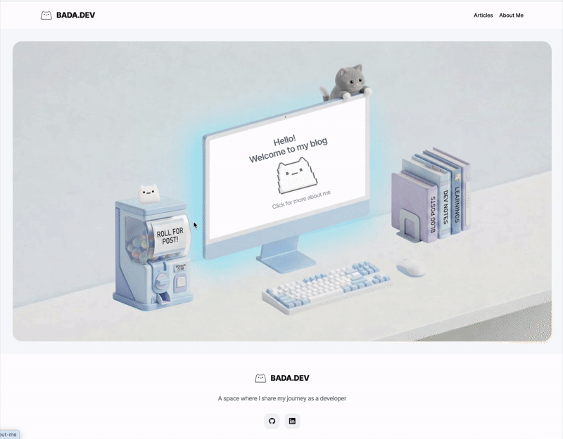

# BADA.DEV

<p align="center">
  
</p>

<p align="center">
  개발자의 트러블슈팅과 기술적 성장을 담는 기술 블로그
</p>

<p align="center">
  
  
  
  
  
</p>

🔗 **배포 URL**: [bada-dev.vercel.app](https://bada-dev.vercel.app)

---

## 📖 소개

**BADA.DEV**는 트러블슈팅과 학습 기록을 위한 1인 기술 블로그입니다.
콘텐츠(MDX 아티클)와 코드를 한 레포에서 관리하며, 작성부터 검증·배포까지 반복되는 운영 작업을 자동화했습니다.

**첫번째 글 구경하기 :**
📝 [AI로 블로그를 만들며 깨달은 것](https://bada-dev.vercel.app/articles/2026-03-11-ai-techblog-responsiblity-over-speed)

## 🖼️ 화면 미리 보기

<p align="center">
  
</p>


## ✨ 주요 기능

- **아티클 목록/상세**: MDX 기반 아티클 렌더링, 카테고리 필터, 검색, 목차(TOC) 자동 추적
- **통계**: 아티클별 조회수·공유수 기록 (Supabase)
- **모바일 공유**: 네이티브 공유 시트 연동

## 🛠️ 기술 스택


| 분류            | 기술                                     |
| ------------- | -------------------------------------- |
| Framework     | Next.js 16 (App Router)                |
| Language      | TypeScript 5 (strict mode)             |
| Runtime       | React 19                               |
| Styling       | Tailwind CSS                           |
| State         | Zustand                                |
| Data Fetching | TanStack React Query                   |
| Content       | MDX (`next-mdx-remote`, `gray-matter`) |
| DB            | Supabase (PostgreSQL)                  |
| CI/CD         | GitHub Actions, Vercel                 |
| Test/Docs     | Vitest, Storybook                      |


## 📁 폴더 구조

```sh
tech-blog/
├── src/
│   ├── app/            # Next.js App Router
│   ├── components/     # 공통 컴포넌트
│   ├── services/        # API 클라이언트, 훅
│   ├── stores/           # Zustand
│   └── utils/            # 유틸리티
├── public/
│   └── articles/         # MDX 아티클 + 이미지
└── scripts/               # 아티클 생성/검증/동기화 CLI
```

## 🚀 로컬 실행

```bash
yarn install
yarn dev        # http://localhost:3000
```

```bash
yarn build      # 프로덕션 빌드
yarn test       # 테스트
yarn storybook  # 컴포넌트 문서
```

## 🤖 운영 자동화

1인 운영에서 반복되는 작업을 CLI·CI로 자동화했습니다.

- `yarn create:article` — 대화형 CLI로 frontmatter가 채워진 MDX 템플릿 생성
- **Articles CI**: PR에서 변경된 아티클만 선별 검증(필수 필드·날짜 형식·카테고리), 실패 시 병합 차단
- `yarn sync:stats` — 아티클 목록과 통계 테이블 자동 동기화 (CI에 통합)

